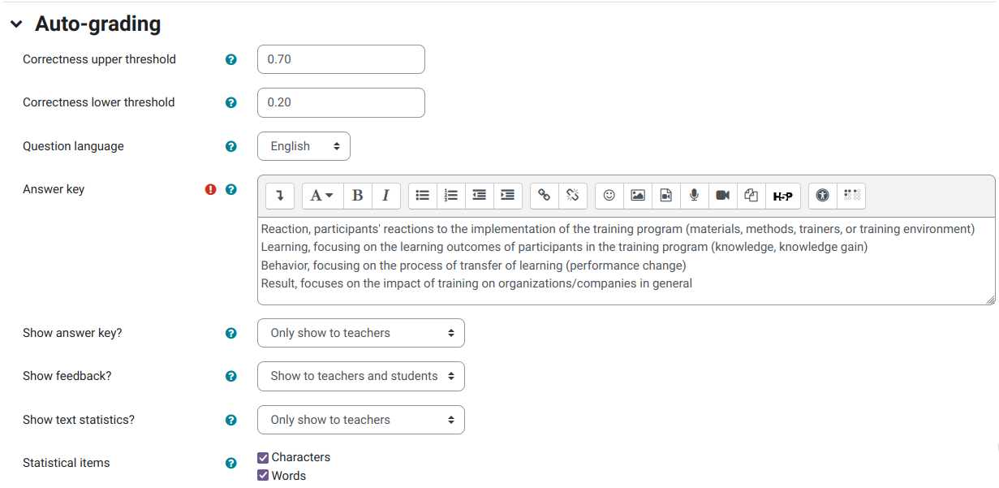
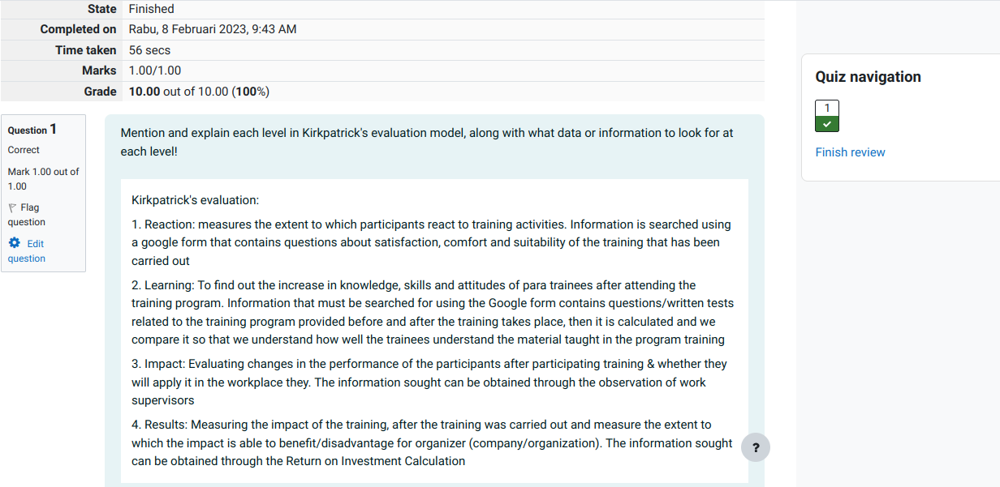
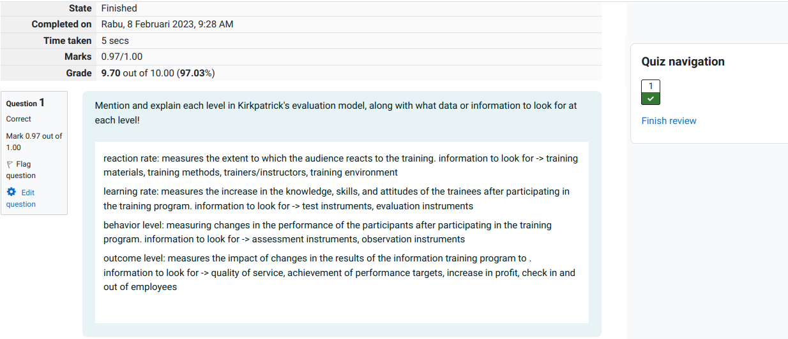

# Essay Similarity Checker (WIP)
Is a moodle question type plugin that compares the similarity between student's answer and teacher's answer key using cosine similarity algorithm, and uses the similarity to auto grade the answer. The automatic grade can be manually overridden by the teacher
## Previews






## Features
- Auto grading
- Support every language (see note)
- Answer key
- Statistical text
- Show/hide the answer key, statistical text, and feedback to student/teacher/both

## Installation
You can choose the following method that suits you to install the plugin
### Using Terminal
Go to your moodle root directory and execute the following command
```
git clone https://github.com/thoriqadillah/essaysimilarity.git question/type/essaysimilarity
```
### Manual
Download the zip and extract it to the question/type inside your moodle root directory

After that go to site administration page and it should shows that new plugin is present

## Note
- This plugin does not intent to replace teacher evaluation for grading student response. Instead, what this plugin intent is to help easen teacher's evaluation process. For example, if multiple responses has similarity 0.80, 0.88, 0.78, 0.30, and 0.25, maybe you should only manually re-evaluate the student's response with the score 0.30 and 0.25, and only quick skim the rest for final grading
- In general, this plugin supports every language, but this plugin will be more accurate if it has the implementation of specific language for pre-processing. You can select `none` if your language is not detected in question language option
## Add Your Language
Pre-processing is pretty important to improve the accuracy of the similarity checker. Pre-processing will clean the documents such as removing stopwords, stem the words and weight the value of each word so the documents we are comparing is in the same class. If you select `none`, it will only do the weighting for each word. If you want to add your language, you need to do the following:

1. Add list of stopword of your language inside `essaysimilarity/nlp/preprocessing/stopword/lang`, and add a file named with [ISO 639-1](https://en.wikipedia.org/wiki/List_of_ISO_639-1_codes) of your language. For example, english is en, therefore the name is `en.php`. And inside the file, return an array of list of the stopword
```php
<?php

return [
  // list of stopwords of your language
];
```
2. Add folder of your language inside `essaysimilarity/nlp/preprocessing/stemmer/` named with [ISO 639-1](https://en.wikipedia.org/wiki/List_of_ISO_639-1_codes). Inside that folder you must create a file named with [ISO 639-1](https://en.wikipedia.org/wiki/List_of_ISO_639-1_codes).php i.e `en.php`. 
Everything else is optional, i.e dictionary.php is for list of root words from your language. If the dictionary.php is present, the content of the file needs to return array of root words of your language, just like stop words part. The content of `LANG_CODE.php` file needs to be as follows:
   
```php
<?php

include('./../stemmer.php');

class LANG_CODE_stemmer implements stemmer { // change the LANG_CODE with ISO 639-1 of your language, i.e en => en_stemmer

  private $dictionary; // you can change the variable to match your language i.e dictionary -> kamus in indonesia

  // (optional) if your stemming implementation needs dictionary, then import it this way
  public function __construct() {
    $this->dictionary = require('dictionary.php');
  }

  public function stem($word) {
    // your implementation of stemming
  }
}
```

3. Last but not least, add string in `essaysimilarity/lang` with `language_<LANG_CODE>` where the `LANG_CODE` is the [ISO 639-1](https://en.wikipedia.org/wiki/List_of_ISO_639-1_codes) of your language, i.e `$string['language_en'] = English`. After that, purge the cache of language string on site administration page and you should see your language in Question Language option. 
   
2. (Optional) translate the entire language string of this plugin. People from the same country of yours may use this plugin and they use the translation. But may be they not. We never know :)

Finally, you can submit your code as contribution to this plugin so people can make use of your code :)

## License
[GPL v3](https://github.com/thoriqadillah/essaysimilarity/blob/main/LICENSE)

Thanks to (@gbateson) Gordon Bateson's [plugin](https://github.com/gbateson/moodle-qtype_essayautograde) that helps me to build my own plugin